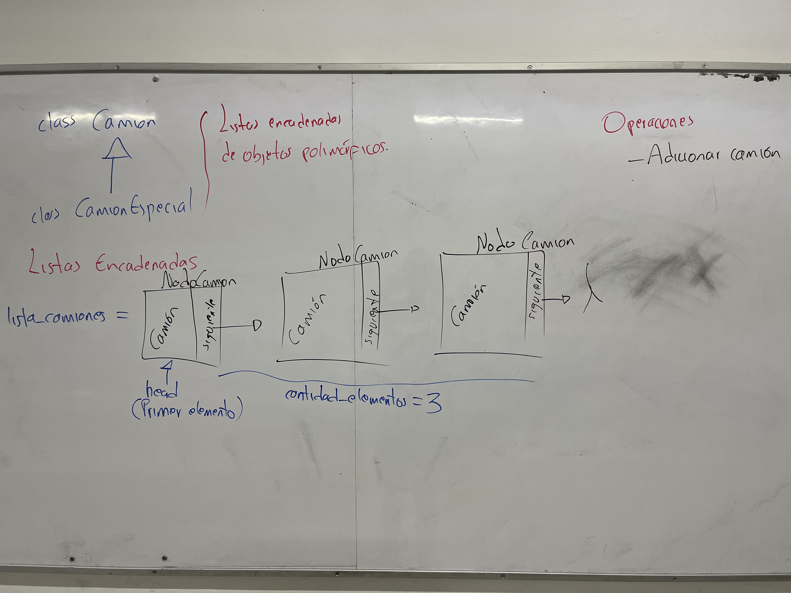
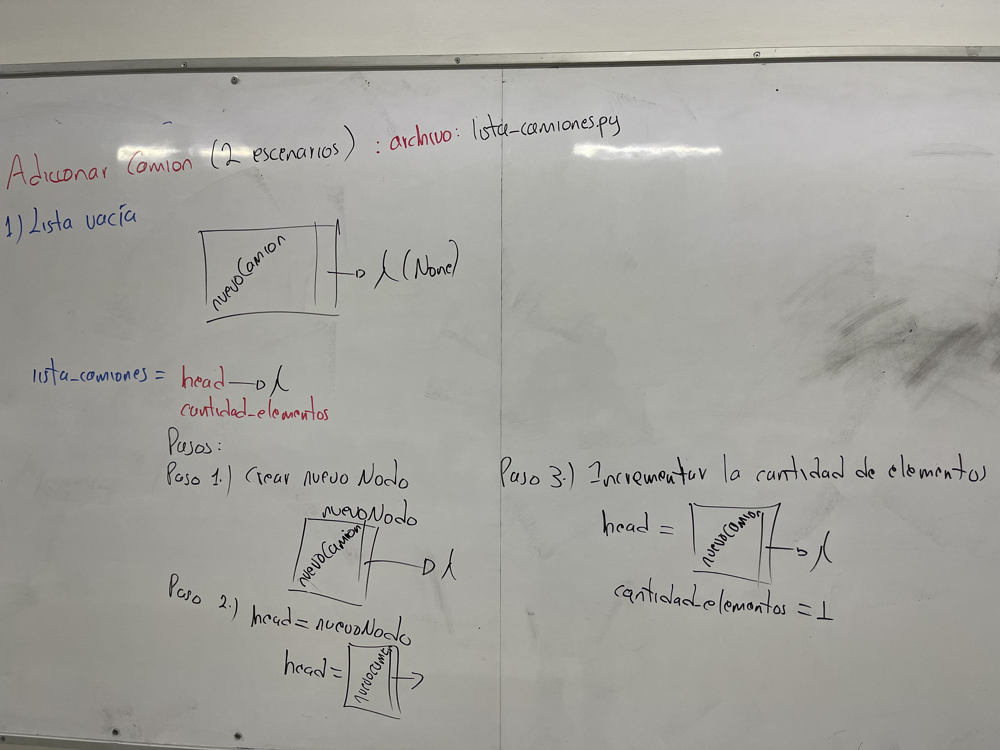
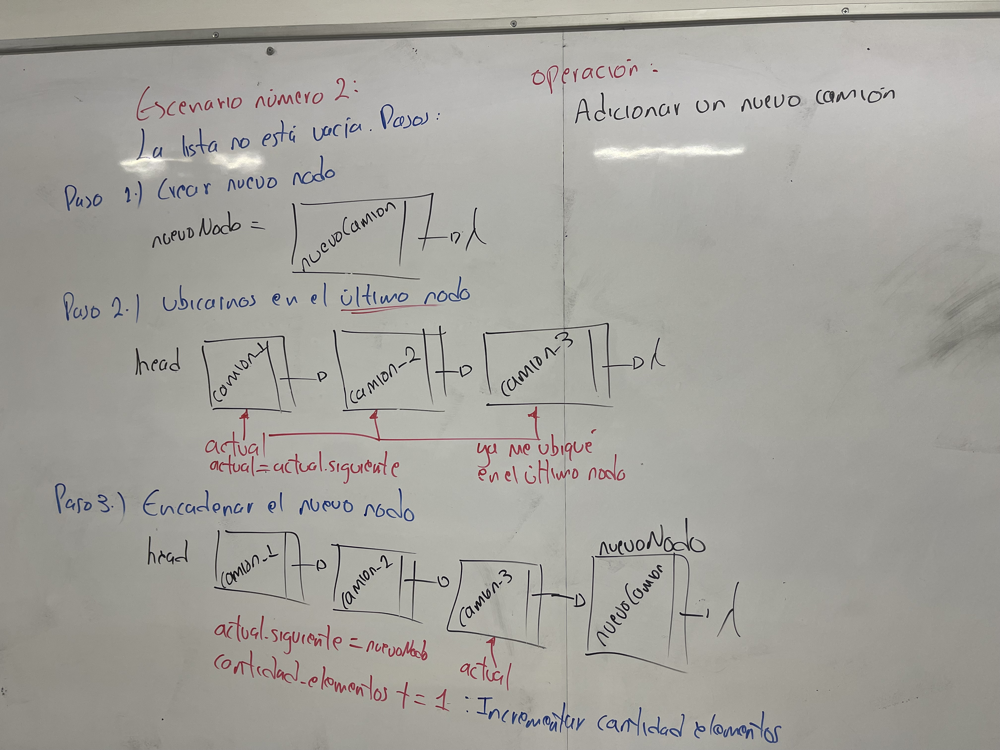

#Proyecto con operaciones sobre una lista enlazada

## Concepto del proyecto en clase

## Operación: Adicionar un elemento a una lista enlazada vacía

## Operación: Adicionar un elemento a una lista enlazada no vacía
